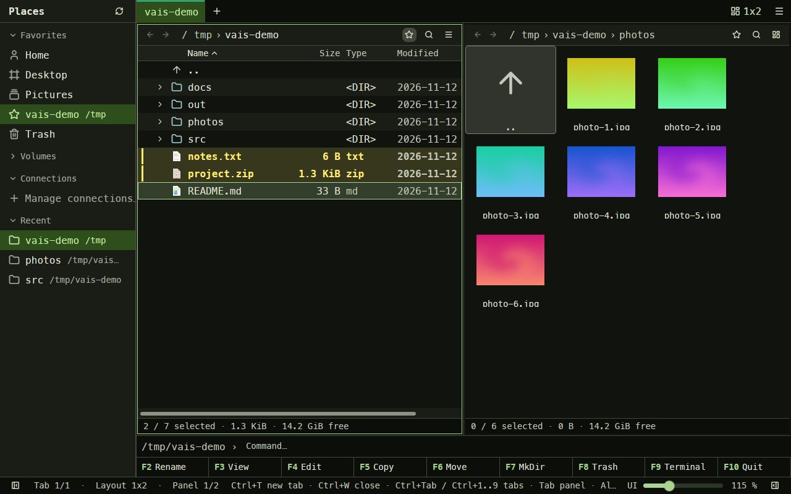
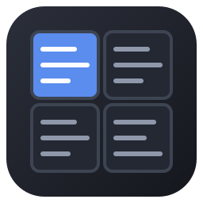

<h1 align="center">VAIS apps</h1>

<p align="center">
  <b>Keyboard-first desktop apps in Rust, built on <a href="https://gpui-kit.com">gpui-kit</a> (GPUI from Zed).</b>
</p>

<p align="center">
  
  
  
</p>

VAIS stands for *vibecoded AI slop*: these apps are written with AI coding agents, one feature
at a time. They share a look (the Cechi light and dark themes), the habit of doing everything
from the keyboard and, as more apps join, their building blocks. Linux is where they are
developed and tested; CI builds and tests them on macOS and Windows as well.

## The apps

<!-- One card per app. With a second app: two cards per row, td width="50%" and the
     screenshots width="100%". -->
<table>
<tr>
<td width="640" valign="top">
<a href="apps/vais-commander/README.md"></a>
<p> <b>VAIS Commander</b>: a keyboard-driven file manager in the spirit of Total and Midnight Commander, with a configurable grid of panels, tabs, SFTP and FTP, archives, thumbnails and a command palette.</p>
<p><a href="apps/vais-commander/README.md">README</a> · <a href="https://github.com/cechi/vais-apps/releases/latest">Download</a> · <a href="apps/vais-commander/CHANGELOG.md">What's new</a></p>
</td>
</tr>
</table>

## Layout

```
apps/<app>/      one crate per application, with its assets, scripts and CHANGELOG.md
Cargo.toml       the workspace: members and build profiles
```

## Build

```sh
cargo build                      # every app
cargo run -p vais-commander      # one app
cargo test                       # all tests
```

## Releases

Each app is released on its own. The tag names the app and its version, e.g.
`vais-commander-v0.5.0`: the `Release` workflow builds that app, checks the tag against its
`Cargo.toml` and publishes a release named after its README heading ("VAIS Commander
0.5.0") with its `CHANGELOG.md` section as the notes. A suffix after the version
(`-beta.1`) makes a pre-release.

All apps share the repository's release list, but only VAIS Commander's releases become
**Latest** (`LATEST_APP` in `.github/workflows/release.yml`), so
`/releases/latest/download/...` keeps pointing at it. Links to another app's downloads name
its tag.

## License

[MIT](LICENSE)
